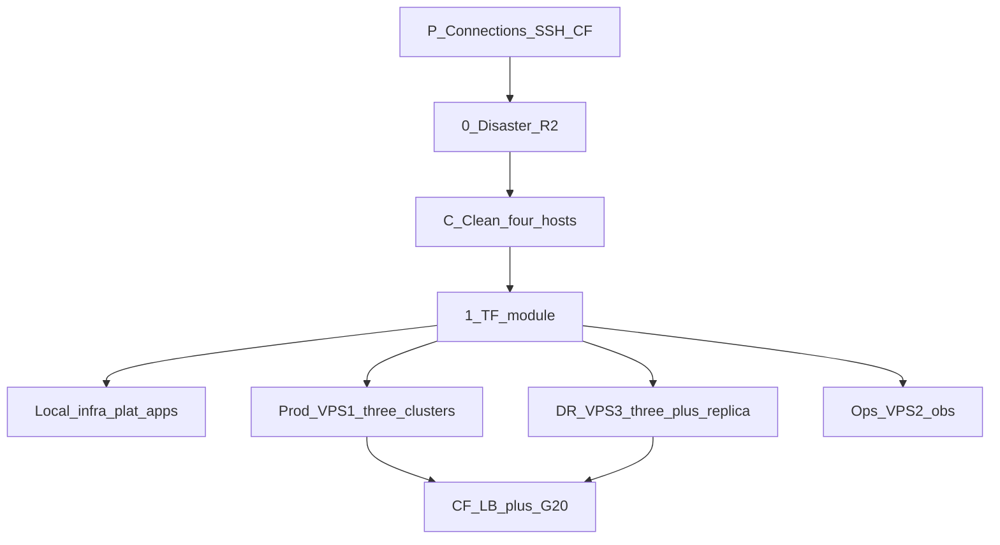
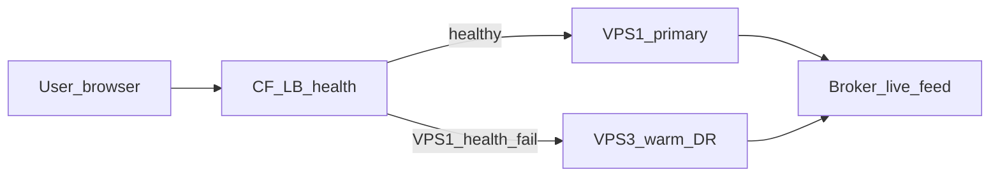

# PLAN — kind-fleet-clusters

| Field | Value |
|-------|--------|
| Kind | `feature` |
| Slug | `kind-fleet-clusters` |
| Lead repo | `am-infra-automation` |
| Other repos | `amctl`, `am-gitops`, `am-infra` (kube/tunnels), `VPS` (kubeconfigs) |
| Target env | **Four together:** `dev` + `prod` + `dr` + `obs` after one clean. **No PP / PP-DR. No `local` token.** |
| Branch | `feature/kind-fleet-clusters` |
| UI previews | n/a — no modern-ui screen change |
| Delivery rating | 8/10 (5 blockers locked; Execute not started) |
| Design rating | 8.6/10 (PG primary/standby + Mongo RS; CF auto; JWT + live quotes) |
| Scorecard overall | 8.6/10 |
| Agent satisfied | no — user must review this pack, then confirm Execute |

Diagram: [architecture.drawio](architecture.drawio) · Checklist + **what we use**: [TODO.md](TODO.md) · Gaps: [GAPS.md](GAPS.md)

## Goal

Stand up **3 Kind clusters** on VPS1 (prod), VPS3 (prod-DR), and laptop (**dev**), plus **1 obs/Grafana cluster** on VPS2. One host = one env name. One Keycloak login for all UIs. Terraform state on that host. VPS is read/write only. After **each layer**: Implement → **Test (this phase)** → **Test (grown)** → only then the next layer.

## How every phase works (the loop)

Do **not** batch infra + platform + apps. One layer at a time:

```text
Prereq → Implement → ~/.asrax + mcp-sync → Test (this phase) → Test (grown)
       ↑                                                          |
       +-------------- fail: stay on this phase ------------------+
       both green → next phase
```

1. **Prereq** — previous phase **Test + Test (grown)** green.
2. **Implement** — this layer only.
3. **MCP** — `am ai sync` + `am ai mcp-sync`; fix via MCP.
4. **Test (this phase)** — checklist in [TODO.md](TODO.md) for *this* layer.
5. **Test (grown)** — earlier phases still true. The list **grows** each phase. Fail → stay.

**G26 (once, after DBs exist):** access is **`*.asrax.in` only**. Never `localhost`, `127.0.0.1`, `host.docker.internal`, or a Docker-host IP in Vault, Helm, Traefik, OIDC, or MCP. Same-host stores: **DNS-only** name → that host’s private/WG IP (not orange-cloud).

**Before any Kind/terraform on a VPS:** Phase 5 for that host must be green (SSH works, `am-ops` exists, sudo/delete denied). Remaining VPS work uses **only** `am-ops`. Root is break-glass only.

`~/.asrax` is the MCP source (not this git repo). VPS terraform state: `/data/am-state/terraform/…`. Local terraform state: `~/.asrax/tfstate/dev/`.

## World-class feature map

### P0

- **Phase P first — start and test all:** IPs from [VPS/.env](../../../VPS/.env) (`VPS_IP`, `VPS_2_IP`, `VPS_3_IP`). Laptop local/dev Docker + SSH all three VPS + Cloudflare MCP (zone/tunnels/R2). **Then** Phase 0 dump, then Phase C. No secrets from `.env` in git.
- Local clean = **Kind/k8s in Docker only** (not laptop wipe). VPS clean = Kind + unused Docker to **free disk**.
- After clean: security `am-ops` on each VPS; layer MCP gates **per host**.
- **VPS3 full DR stays running.** **Postgres primary→standby + Mongo replica** over WireGuard (G20). R2 dump = disaster backup only. ~10k / 6 months → 32 GB DR.
- **Cloudflare Load Balancing auto-failover** to VPS3 when `/health` on `am`+`auth` fails. **No auto-failback.** Planned wipe: stop VPS1 Kind so health fails, then LB moves traffic.
- VPS2 Grafana **parallel**. No Grafana on rebuilt VPS1. No `kagent`.
- One Keycloak `am-realm` login for **all UIs** (product + infra consoles). Domain per UI; OIDC after Vault rewrite (G24).
- Phase 2 order (same on **dev / prod / dr**): `kind create` → **Traefik + cloudflared + tunnel** → TCP exposer + DNS-only A → stores → **IngressRoutes** → **Test on domain (G27)** → **then** seed. Do not skip Edge. Tunnel origin is Traefik only (no per-Service bypass).
- Vault: copy **key names only** from working preprod (`apps/data/preprod/infra/*` + `services/<service>`). **Do not copy values.** Inspect each key; rewrite host / JDBC / issuer / redirect / advertised URL to this env’s domain (G23).
- Phase 4 order (**4a–4g**): seed (if not done) → Vault rewrite + **G25** (`am-backend-sa` + CSI, **no injector**) → am-gitops retarget (`dev` + scaffold `dr/`) → gateway/AI/UI → identity + token Test → market → portfolio/trade/doc → remaining services → **Postman MCP `runCollection` closout**. Argo from `am-gitops` `main`; Helm/`am deploy` = break-glass.

### P1

- `am deploy --env dev` → laptop `am-apps-dev`. `--env local` hard-fail. prod/dr → matching apps cluster.
- VPS `am-ops`: no sudo, no delete, no admin.
- Vault K8s auth **per apps cluster** (G25). App SA **`am-backend-sa`**. CSI Secrets Store on the apps cluster. **No** Vault Agent Injector / sidecar on app pods.

### P2

- Tempo on VPS2; local Alloy to VPS2; Kafka replica only if Phase 12 says bus loss hurts.

## First-run / virtual value UX

N/A — infra pack, no paper-trading / broker money.

## Locked: reduce downtime (low extra machinery)

Do **not** add Cilium, a fourth VPS, or Kafka replica unless Phase 12 says so. **Postgres streaming + Mongo replica** are P0 (G20). VPS3 is warm always-on DR. Cloudflare LB auto-redirects. Dumps do **not** sync DR.



**Accepted:** prod is down from Phase C until VPS1 `/health` is back. That is the greenfield start. G20 + CF LB come **after** prod and DR infra exist.

### Phase C — Clean four hosts (after dump only)

| Host | Clean | Keep |
|------|--------|------|
| **Local** | `kind delete` all `am-dev-*` (and leftover Kind containers). Docker **k8s only** | `~/.asrax`, laptop R2 pull, repo, Docker engine |
| **VPS1 prod** | Break-glass: `kind delete` `am-preprod` / any Kind; `docker image prune` / unused volumes to **free disk** | R2 already has daily dump; `/data/am-state` copy to R2 then may reset |
| **VPS3 DR** | Same Kind + Docker free | Empty box is OK |
| **VPS2 ops** | Same Kind + Docker free | Empty box is OK |

Do **not** Phase C until Phase 0 laptop pull is verified. Do **not** wipe the laptop OS or `~/.asrax`.

### Four tracks together (after C + Phase 1)

Same layer loop on each track. Hosts may run **in parallel**. Do not skip MCP gates on a host.

| Track | Host | Clusters | After infra |
|-------|------|----------|-------------|
| Dev (optional lab) | laptop | `am-dev-*` slim | Product apps only until moved; **creds SoT on VPS2** |
| Prod | VPS1 | `am-prod-infra` / `apps` / `platform` | Writer PG/Mongo; CF primary |
| DR | VPS3 | `am-dr-*` | PG standby + Mongo secondary (G20); CF fallback |
| Ops + shared platform | VPS2 | `am-obs` + platform tools | Grafana/Prom/Loki/Tempo; Vault **`apps/data/dev`**; OpenProject/Lago/Langfuse/… — [VPS2_DEV_PLATFORM.md](VPS2_DEV_PLATFORM.md) |

| Move | Why it cuts downtime | Extra cost |
|------|----------------------|------------|
| **Warm DR always running** | VPS3 stack stays up. Unplanned VPS1 death → CF LB fails `/health` → users already have a live DR | VPS3 ≥ 32 GB |
| **CF LB auto-failover** | Primary pool VPS1, fallback VPS3. `am`+`auth` together. **No auto-failback** (human Phase 9) | CF Load Balancing + MCP |
| **Greenfield clean (C)** | Free VPS disk; local only deletes Kind. Then all four start from step 1 | Prod down until rebuilt |
| **PG + Mongo realtime (G20)** | VPS1 primary → VPS3 standby/secondary over WireGuard. Login + positions live. Promote on failover | Private WG + promote script |
| **R2 disaster dump** | Daily from current primary. Both-VPS-dead only. Never restore onto a live replica | Daily cron |
| **VPS2 not a gate for rebuild** | Grafana can move later. Do not block prod infra on buying obs | VPS2 parallel |
| **Break-glass** | Time-boxed root / cluster-admin from provider console when disk-full or stuck STS. Day-2 stays `am-ops` | Process, not new software |
| **MCP env lock** | `~/.asrax/credentials.d/dev.env` vs `prod.env`. Refuse prod MCP if kube context is `am-dev-*` | Two env files |

**User-visible min bar (10k users):** page + live ticks + **same JWT** + **live positions/orders**. A login 2 seconds ago is already on VPS3 (PG WAL). Redis is not the session.



**Target:** unplanned RTO ≈ 30–60s. RPO ≈ **seconds** (PG WAL + Mongo oplog). Market RPO ≈ 0.

**Do not:** wipe Kind `am-preprod` while users still point at VPS1. **Do not** run old + new full stacks on VPS1 at once (RAM).

## Remaining gaps

Full table: **[GAPS.md](GAPS.md)**. Locked G20–G27: replica, seed **after** domain Test, no port-forward, Vault rewrite, consoles, CSI SA, domain-only.

## Latency & consistency

- User HTTPS: Cloudflare LB (health ≈30s) then tunnel. Auto to VPS3; failback human.
- DR data: **streaming PG + Mongo replica** (seconds). R2 = disaster backup only.
- Planned rebuild: users stay on VPS3 (same URLs) during VPS1 wipe.
- Grafana on VPS2 stays up if VPS1 dies; login needs Keycloak (move `auth.asrax.in` with `am.asrax.in`).

## Current system (verified)

- One Kind per host today. Contabo Kind name `am-preprod` **was** prod ([am-infra/k8s/kind-config.yaml](../../../am-infra/k8s/kind-config.yaml)); Phase C deleted it. **Do not recreate that name.**
- Fleet Terraform computes `am-<env>-<role>` / `am-obs` and refuses `local` / `preprod` ([terraform/modules/core/cluster](../../terraform/modules/core/cluster)). Entry points: [terraform/kind-fleet](../../terraform/kind-fleet). Do **not** apply `terraform/foundation/{local,preprod}`.
- `am deploy --env dev` still targets ITSmart ([amctl deploy options](../../../amctl/src/am_cli/deploy/options.py)).
- Grafana/Loki live on Contabo; isolation exception Alloy → Contabo `:8910/:8911`.
- Infra UI SSO is Authentik today; apps already use Keycloak `am-realm`.

## Target journeys

1. Operator applies **one** layer, MCP-verifies, then the next.
2. User opens **every console** (modern-ui, MinIO, Grafana, Argo, Headlamp, Kafka UI, pgAdmin, …) on its env domain with the **same** Keycloak user; roles decide access.
3. VPS1 down: CF LB → VPS3. Promote PG + Mongo. Page + same JWT + live quotes + live positions.

## Identity & ownership

- IdP: Keycloak only. Realm `am-realm`. No Authentik on new clusters.
- Roles: `am-admin`, `am-ops`, `am-viewer`, `am-user` (see table below).
- Clients (OIDC or oauth2-proxy in front): `am-modern-ui`, `am-gateway`, `minio`, `grafana`, `argocd`, `headlamp`, `kafka-ui`, `pgadmin`, `mongo-express`, `redis-ui`, `vault-ui`, `influx-ui`, `temporal-web`, `lago`, `traefik`. Secrets in Vault after rewrite.

| Role | App | Grafana | MinIO | Keycloak | Argo | Infra consoles |
|------|-----|---------|-------|----------|------|----------------|
| `am-admin` | full | Admin | consoleAdmin | realm-management | admin | all |
| `am-ops` | app + ops | Editor | readwrite | none | readonly | Headlamp/Kafka/pgAdmin/Mongo/Redis/Vault/Influx |
| `am-viewer` | read-only | Viewer | readonly | none | readonly | read-only where the UI allows |
| `am-user` | normal login | none | none | none | none | none |

## State & money

N/A for money. Infra state:

- Prod writes only on the **current PG/Mongo primary** (VPS1 until failover).
- Sync to VPS3: **Postgres WAL + Mongo oplog** over WireGuard. R2 dump is not the sync path.
- Terraform state stays on that host (not in git).

## Isolation

| Host | Env | App NS | Forbidden |
|------|-----|--------|-----------|
| VPS1 | prod | `am-apps-prod` | `am-apps-dev`, leftover `am-apps-local`, preprod/dr, `kagent` |
| VPS2 | ops/dev hub | none (no product `am-apps-*`) | `am-apps-prod` / `am-apps-dr`, `kagent` |
| VPS3 | dr | `am-apps-dr` | `am-apps-prod`, leftover local/dev/preprod, `kagent` |
| Laptop | `dev` lab (optional) | `am-apps-dev` | prod/preprod/dr; **do not** treat laptop Vault as SoT |

## Inventory (clusters / nodes / namespaces)

Kind defaults on every cluster: `kube-system`, `kube-public`, `kube-node-lease`, `local-path-storage`.

| Host | Cluster | Nodes | Namespaces |
|------|---------|-------|------------|
| VPS1 | `am-prod-infra` | CP + worker | `infra`, `vault`, `monitoring` (Alloy) |
| VPS1 | `am-prod-apps` | CP + worker | `am-apps-prod`, `edge`, `monitoring` |
| VPS1 | `am-prod-platform` | CP + worker | `identity`, `argocd`, `temporal`, `am-ai`, `billing`, `growthbook`, `monitoring` |
| VPS2 | `am-obs` (+ platform NS as needed) | CP + worker (or 1) | `monitoring`, `edge`, `vault`, billing/growthbook/openproject/n8n/… — [VPS2_DEV_PLATFORM.md](VPS2_DEV_PLATFORM.md) |
| VPS3 | `am-dr-*` | 1 CP each | same short names; app NS = `am-apps-dr` |
| Laptop | `am-dev-*` (optional) | 1 CP each | product `am-apps-dev` + agents; platform tools prefer VPS2 |

Same-host API ports: infra `6443`, apps `6444`, platform `6445`. Obs on VPS2 uses `6443`.

## Cross-cluster & Cloudflare

- Same-host clusters do **not** share `*.svc`. After seed (**G26**): apps/platform use **DNS-only** `*.asrax.in` names (not orange-cloud). Those names resolve to the host private/WG IP. **Never** `localhost`, `127.0.0.1`, `host.docker.internal`, or Docker-host IP in config (G4, G6).
- One cloudflared per host. MCP (`user-cloudflare`) owns DNS/tunnel. Pattern = preprod (`*-preprod.asrax.in`) with env token. Dev consoles: `*-dev.asrax.in` (prefer **VPS2 hub**). Prod: `am`, `auth`, `argocd`, `minio`, `vault`, plus console hosts. DR: `*-dr.asrax.in`. Obs (**no** env suffix): `grafana` / `loki` / `prometheus` / `tempo`.asrax.in. **Dev credential SoT:** VPS2 Vault `apps/data/dev/` — [VPS2_DEV_PLATFORM.md](VPS2_DEV_PLATFORM.md). DB A records stay **DNS-only**.
- Failover: CF LB as above + **promote VPS3 PG/Mongo**. Replication only on WireGuard IPs (not public :5432/:27017).
- No auto-failback. VPS1 returns as standby and catches up before a human flips LB.

## Security (VPS)

- Day-2 user `am-ops`: no sudo, no `kubectl delete`, no `terraform destroy`, no `kind delete`.
- K8s verbs: get/list/watch/create/update/patch only.
- Admin / destroy only on laptop `am-dev-*`. Root on VPS = break-glass only (see below).
- Argo `prune: false` on VPS.
- Bootstrap (first Kind create) may need root **once**; after clusters exist, day-2 is `am-ops`.

## Phase list (prereq → implement → MCP verify)

### Phase P — Connections first

| Step | What |
|------|------|
| Prereq | Laptop; SSH keys; `~/.asrax`; VPS IPs; Cloudflare MCP in catalog |
| Implement | Load `VPS/.env` IPs only. Start/test laptop Docker (local/dev) + SSH `VPS_IP` / `VPS_2_IP` / `VPS_3_IP` + Cloudflare MCP zone/tunnels/R2 |
| Test | One SSH per existing VPS + one Cloudflare MCP call (zone or tunnels). No port-forward |
| Gate | **Do not dump-wipe or Phase C** until this is green. CF MCP stays loaded for later DNS / gateway tunnel |

### Phase 0 — Disaster dump only (G5)

| Step | What |
|------|------|
| Prereq | **Phase P green**; R2 bucket; **`F:\am-repos\asrax-db-backups`** exists (`BACKUP_ROOT`) |
| Implement | **Daily** job on **current primary**: PG + Mongo + Vault + MinIO + PKI + tfstate → R2. **Not** used to sync DR |
| MCP verify | R2 list of latest daily prefix |
| Gate | Laptop pull verified. **Then Phase C.** No Kind delete before this gate |

### Phase C — Clean (four hosts, then start together)

| Step | What |
|------|------|
| Prereq | Phase P + Phase 0 gates (SSH + Cloudflare MCP still up) |
| Local | `kind delete cluster` for every `am-dev-*`. Remove leftover Kind node containers. **Do not** uninstall Docker, **do not** delete `~/.asrax` |
| VPS1/2/3 | G1: `kind delete` all AM Kind; prune unused Docker images/volumes; free disk. Optional reset `/data/am-state` after R2 has tfstate |
| Verify | `kind get clusters` empty on that host; `df` shows space back |
| Gate | All four hosts clean. Then Phase 1 + **four tracks in parallel** |

### Phase 1 — Terraform Kind module

| Step | What |
|------|------|
| Prereq | Phase 0 gate; repo checkout |
| Implement | `env` + `cluster_role` **compute** Kind name (`am-<env>-<role>` / `am-obs`). Hard-fail `local`/`preprod`/`hostbet-vps`. Ports 6443/6444/6445. `node_shape` one (dev/dr/obs) vs two (prod). Drop third obs worker. Optional mounts off on laptop. Stacks [terraform/kind-fleet/{dev,prod,dr,obs}](../../terraform/kind-fleet). State: laptop `~/.asrax/tfstate/dev/<role>/`; VPS `/data/am-state/terraform/{prod,dr,obs}/`. Never apply `terraform/**/{local,preprod}` |
| MCP verify | n/a (code). `terraform init -backend=false` + `terraform validate` on each kind-fleet stack |
| Gate | Module can **name** a cluster. **No** `terraform apply`. **No** `kind create` |

#### am-infra vs Terraform (Phase 1 inventory)

| In am-infra today | In Terraform today | Fleet decision |
|---|---|---|
| Postgres, Mongo, Redis, Kafka, Influx, MinIO, Vault | `modules/apps/*` exist | Reuse in Phase 2; one store set per env host |
| Traefik, Cloudflare, port-exposer | `core/edge` (slim Helm Traefik + cloudflared), `core/port-exposer` | **Phase 2 first** — before stores. Do not apply fat `core/traefik` (Authentik/preprod). OIDC later |
| Grafana / Headlamp | `apps/grafana`, `apps/headlamp` | Obs cluster only (VPS2 + laptop `grafana-dev`) |
| Temporal lab Helm + UI | `modules/apps/temporal` | Phase 3b P0. User `temporal` on PG `platform` |
| Lago / billing | `modules/apps/lago` | Phase 3c P0. User `lago` on PG `platform`. **Not** `am-subscription` |
| Keycloak | Authentik in TF | New Keycloak; drop Authentik — Phase 3a. User `keycloak` on PG `platform` |
| Argo CD | gitops YAML only | New `modules/apps/argocd` — Phase 3a |
| n8n | `modules/apps/n8n` | Phase 3d P1. User `n8n` on PG `platform` (no SQLite) |
| GrowthBook | `modules/apps/growthbook` | Phase 3d P1. User `growthbook` on Mongo `platform` |
| OpenProject | `modules/apps/openproject` | Phase 3d P1. User `openproject` on PG `platform` |
| LiteLLM | `modules/apps/litellm` | Phase 3d P1. User `litellm` on PG `platform`. NS `am-ai` |
| Langfuse | `modules/apps/langfuse` | Phase 3d P1. User `langfuse` on PG `platform` + Redis ACL + MinIO. ClickHouse in-module |

### Phase 2 — Infra (`am-*-infra`) — Edge before stores

Same Implement list on **dev / prod / dr**. Env token in the name (`-dev` / bare prod / `-dr`).

| Step | What |
|------|------|
| Prereq | Docker; `~/.asrax/credentials.env`; Phase 1. VPS tracks: that host’s Phase 5 green |
| Implement | `kind create` `am-<env>-infra` :6443. State: laptop `~/.asrax/tfstate/dev/`; VPS `/data/am-state/terraform/{prod,dr}/` |
| Implement | **Edge (gate, first):** Helm Traefik in `infra` ([modules/core/edge](../../terraform/modules/core/edge)); `cloudflared`; tunnel `asrax-<env>-tunnel`. Proxied CNAME HTTPS names → tunnel. Tunnel origin = `http://traefik.infra.svc.cluster.local:80` only |
| Implement | **TCP publish:** port-exposer. DNS-only A for `postgres` / `mongo` / `redis` / `kafka` brokers |
| Implement | Helm stores + Vault (injector off). KV `apps`. Policy `am-apps-read`. Shared PG/Mongo `platform` + per-module users (empty) |
| Implement | **Configure gateways:** `enable_gateway=true`; IngressRoutes (Vault, MinIO/S3, Influx, Traefik dashboard, pgAdmin, mongo-express, kafka-ui, redis-ui). Host = `prod` bare / else `name-<env>.asrax.in` |
| Test before seed | [TODO](TODO.md): HTTPS via CF → tunnel → **Traefik** → Service. TCP via DNS-only A. **No port-forward** (G27). Per-Service tunnel bypass is a **fail** |
| Implement | **Only if that Test is green:** restore `asrax-db-backups\*\latest` |
| Test after seed | Same domains; seed rows visible. No port-forward |
| Gate | Both Tests green. **No AM service yet** |

**DNS split:** HTTPS orange-cloud CNAME (`vault`, `minio`, `s3`, `influx`, `traefik`, `pgadmin`, `mongo-express`, `kafka-ui`, `redis-ui`). TCP DNS-only A (`postgres`, `mongo`, `redis`, `kafka` brokers). Kafka UI is `kafka-ui-<env>` so it does not share the broker A record.

### Phase 3a — Identity (`am-dev-platform`)

| Step | What |
|------|------|
| Prereq | Phase 2 gate; infra ports published |
| Implement | Kind `am-dev-platform` :6445. Keycloak `am-realm` + Argo CD (`prune: false`). Drop Authentik. Enroll infra/apps APIs |
| Implement | OIDC clients for **all UIs** including `lago`, `temporal-web`, `n8n`, `growthbook`, `openproject`, `litellm`, `langfuse` (G24). Redirects = this env’s domains, not preprod |
| Test | Keycloak/Argo **on domain**; OIDC redirects `https://*.asrax.in` |
| Gate | Both Test lists green |

### Phase 3b — Temporal (P0)

| Step | What |
|------|------|
| Prereq | Phase 3a; PG `platform` + user `temporal` + schemas `temporal` / `temporal_visibility` exist |
| Implement | Helm `temporalio/temporal` on **platform**. Frontend `:7233`. UI `temporal-<env>.asrax.in` (prod `temporal.asrax.in`). Attach user `temporal` to PG `platform` via **DNS-only** `postgres-<env>.asrax.in` (not `*.svc` across clusters) |
| Test | Temporal UI on domain; oauth2-proxy / OIDC `temporal-web` |
| Gate | Workflow namespace reachable. No AM apps yet |

### Phase 3c — Lago billing (P0)

| Step | What |
|------|------|
| Prereq | Phase 3a; dedicated PG DB `lago` (OWNER `lago`, `CREATEDB`) — not a schema on shared `platform` |
| Implement | Lago API + front in NS `billing`. UI `lago-<env>.asrax.in` (prod `lago.asrax.in`). Attach user `lago` via `postgres-<env>.asrax.in`. OIDC via Keycloak. **Not** `am-subscription` |
| Test | Lago UI on domain; client `lago` |
| Gate | Billing engine up. Still no second AM service |

### Phase 3d — P1 platform UIs

| Step | What |
|------|------|
| Prereq | Phase 3a; shared `platform` DBs + users exist |
| Implement | n8n, GrowthBook, OpenProject, LiteLLM, Langfuse, Novu. Each module attaches its **user** to PG/Mongo `platform` via `*-<env>.asrax.in`. Langfuse ClickHouse stays in-module (single-node: disable auto CH migrate) |
| Test | Domain / MCP / OIDC verify is **Phase 3e** (not blocking Phase 4 Implement) |
| Gate | Does not block Phase 4 |

### Phase 3 — Ops lessons (laptop → VPS)

Full note (faster setup, challenges, conclusions for prod/DR): [TODO Phase 3 — Ops lessons](TODO.md#phase-3--ops-lessons-laptop--vps-proddr). Highlights: GrowthBook **4.4.0**; exposer Kind-IP discovery after Docker restart; Vault unseal keys; Langfuse `?schema=&sslmode=disable` + no ZooKeeper CH migrate; Lago dedicated DB.

### Phase 4 — Apps Vault + am-gitops waves (4a–4g)

| Step | What |
|------|------|
| Prereq | Phase 3e; DBs seeded in Phase 2 |
| **4a** | **Terraform Vault sync (one go):** [`kind-fleet/<env>/vault-apps`](../../terraform/kind-fleet/dev/vault-apps) + module [`apps-vault-seed`](../../terraform/modules/core/apps-vault-seed) / [`catalog/services.yaml`](../../terraform/modules/core/apps-vault-seed/catalog/services.yaml) → all `apps/data/<env>/infra/*` + `services/*` ready before 4c–4g (G23 rewrite; fleet placeholders). Wrapper `scripts/seed-vault-dev-apps.ps1`. **G25:** CSI + `am-backend-sa` + `auth/kubernetes-apps` → apps API; role `am-backend-role`; injector off. OIDC on existing Traefik for remaining G24. **No product pods required for the Vault gate.** Pattern: [VAULT_ONBOARDING_GUIDE](../../../am-infra/docs/VAULT_ONBOARDING_GUIDE.md) + preprod CSI |
| **4b** | Argo from [am-gitops](../../../am-gitops) `main`: add fleet Vault overlay (`vault-<env>.asrax.in`, CSI like [vault-https-preprod.yaml](../../../am-gitops/preprod/values-overlays/vault-https-preprod.yaml)); retarget `dev/` dest to Kind `am-apps-dev` (not Contabo/`jwt-itsmart`). **Create missing `dr/`** tree for Phase 6 |
| **4c** | Sync gateway + AI gateway + modern-ui |
| **4d** | Sync `am-identity`; **hard gate:** login → access_token + protected call 200 |
| **4e** | Sync `am-market-data`; quote on `am-<env>.asrax.in/market` |
| **4f** | Sync portfolio → trade → document-processor → news/analysis (spot health) |
| **4g** | Sync remaining `dev/apps` (+ `apps-full`); **Postman MCP** Get Token + `runCollection` per service on AM-dev — Phase 4 gate |
| Test | [TODO Phase 4a–4g](TODO.md) |
| Gate | 4g Postman core folders green; CSI/no sidecar; isolation grep |

**Ops note (→ VPS prod/DR):** jot Phase 4 one-time setup into [TODO](TODO.md) as you go so the next host is faster. **Images:** never `latest`. **Roll:** commit `am-gitops/<env>/image-tags/<service>.yaml` (same pin in `dev`/`prod`/`dr` when promoting) → merge to `main` → Argo **manual** sync only (no `automated`); sync `dev` first, operator syncs `prod`/`dr` when ready. **Vault seed:** `terraform/kind-fleet/dev/vault-apps` (module `apps-vault-seed` + `catalog/services.yaml`) — not am-gitops; wrapper `scripts/seed-vault-dev-apps.ps1`. **targetRevision:** prod = `main`/`master` only; dr values = `main`/`master`/`dr`/`devstrategy`; dev = feature branches OK — see `am-gitops/docs/TARGET_REVISION_POLICY.md`. **No port-forward (G27):** Vault and all gates use real `*.asrax.in` domains only — never `localhost` / NodePort / `kubectl port-forward`.

Gitops gap today: `dev/` exists but Contabo-oriented + wrong Vault overlay; **`dr/` missing** — fix in 4b before Phase 6.

### UI hosts (G24) — env token in the name

Same list as working preprod tunnels ([MIGRATION_GUIDE](../../../am-infra/k8s/asrax-tunnels/MIGRATION_GUIDE.md)). Dev example (`dev`); prod drops the token on the main four (`am`, `auth`, `argocd`, `minio`); DR uses `dr`.

| UI | Dev host | Notes |
|----|-------|-------|
| modern-ui | `am-dev.asrax.in` | Keycloak client `am-modern-ui` |
| gateway | same host / API paths | client `am-gateway` |
| Keycloak | `auth-dev.asrax.in` | issuer for everyone |
| MinIO console | `minio-dev.asrax.in` | OIDC |
| Grafana | `grafana.asrax.in` | Kind-fleet Phase **4h** bare hub — [GRAFANA_FLEET_DEV.md](GRAFANA_FLEET_DEV.md). Same FQDN moves to VPS2 in Phase 11 |
| Argo CD | `argocd-dev.asrax.in` | OIDC |
| Headlamp | `headlamp-dev.asrax.in` | OIDC |
| Kafka UI | `kafka-ui-dev.asrax.in` | HTTPS. Broker stays `kafka-dev.asrax.in` (DNS-only A) |
| pgAdmin | `pgadmin-dev.asrax.in` | Postgres UI |
| Mongo Express | `mongo-express-dev.asrax.in` | HTTPS. Broker stays `mongo-dev.asrax.in` (DNS-only A) |
| Redis UI | `redis-ui-dev.asrax.in` | HTTPS. Broker stays `redis-dev.asrax.in` (DNS-only A) |
| Vault UI | `vault-dev.asrax.in` | Vault OIDC |
| Influx UI | `influx-dev.asrax.in` | |
| Temporal Web | `temporal-dev.asrax.in` | platform (Phase 3b) |
| Lago | `lago-dev.asrax.in` | platform NS `billing` (Phase 3c). Prod `lago.asrax.in` |
| n8n | `n8n-dev.asrax.in` | platform NS `n8n` (Phase 3d) |
| GrowthBook | `growthbook-dev.asrax.in` | platform NS `growthbook` (Phase 3d) |
| OpenProject | `openproject-dev.asrax.in` | platform NS `openproject` (Phase 3d) |
| LiteLLM | `litellm-dev.asrax.in` | platform NS `am-ai` (Phase 3d) |
| Langfuse | `langfuse-dev.asrax.in` | platform NS `am-ai` (Phase 3d) |
| Traefik dashboard | `traefik-dev.asrax.in` | oauth2-proxy |

UIs without native OIDC sit behind **oauth2-proxy** → `am-realm`. Same four roles.

### Phase 5 — VPS connect + security first (before any VPS Kind)

Do this **after** Phase 0 prereqs (and local 2–4 if you are on that path), **before** installing Kind/terraform on that box. Repeat 5.1 / 5.2 / 5.3 when that VPS is first touched. Day-2 = **`am-ops`**. Kind create/stop/delete = **G1 break-glass only**.

| Step | What |
|------|------|
| Prereq | Phase 0; SSH key. **5.3:** VPS3 ≥ 32 GB + **WireGuard (or tailscale) VPS1↔VPS3** (G20) |
| Implement | SSH as root **once**: `am-ops`, no sudoers, `am-ops-guard`, `break-glass-kind.sh` (+ `pg_ctl promote` / `rs.stepUp`) |
| Implement | WG: only `:5432` / `:27017` between hosts. Not public |
| Verify | `am-ops`: `sudo true` fails; `kubectl delete` refused. Break-glass script runs **only** the allowlist and logs |
| Gate | Day-2 is `am-ops`. G1 script exists before Phase 6 |

Do **not** start Kind on a VPS until that host’s Phase 5 sub-gate is green. **Do not wipe Contabo until Phase 7 (G2) is done.**

### Phase 6 — VPS3 warm DR + replica (G20)

| Step | What |
|------|------|
| Prereq | Phase 5.3 WG up; VPS3 ≥ 32 GB; **VPS1 still serving** |
| Implement | **G1:** `kind create` three clusters. DSN local (G4). Seed DBs from `asrax-db-backups` **as soon as they exist**. Repeat **Phase 4a–4g** on DR (Vault rewrite + G25 + am-gitops `dr/` waves + API verify). **PG standby + Mongo secondary** from VPS1 over WG. **No** restore-from-R2 cron on PG/Mongo |
| Implement | CF MCP: `am-dr` / `auth-dr`; LB VPS1 primary / VPS3 fallback; `/health`; auto-failback off |
| MCP | Replica lag seconds; JWT from prod works on `am-dr` (G15); live quotes (G19); one portfolio read matches VPS1 |
| Gate | DR running, replica healthy, **not** taking prod writes |

### Phase 7 — Promote VPS3; stop VPS1 (G2, G20)

| Step | What |
|------|------|
| Prereq | Phase 6; replica lag OK; laptop daily R2 pull; user confirm |
| Implement | **G1:** stop VPS1 Kind. **Promote** VPS3 PG + `rs.stepUp` Mongo. CF LB already moving. One writer |
| MCP | `am.asrax.in` on VPS3; still logged in; quotes + positions live |
| Gate | Users on DR. VPS1 writers 0 |

### Phase 8 — Rebuild VPS1 (users stay on DR)

| Step | What |
|------|------|
| Prereq | Phase 7 gate; Phase 5.1; laptop pull still on disk; VPS2 (Grafana) **not** required |
| Implement | **G1:** `kind delete` + `kind create` `am-prod-*`. DSN (G4). **Attach VPS1 PG/Mongo as new standby/secondary** of VPS3 (now primary). No Grafana. No kagent |
| MCP | Prod Vault/Kafka/MinIO/Keycloak/Argo; one app R/W local stores |
| Gate | Isolation grep. **Do not** unfence VPS1 yet |

### Phase 9 — Failback to VPS1

| Step | What |
|------|------|
| Prereq | Phase 8; VPS1 replica caught up from VPS3 |
| Implement | Human: switch PG/Mongo primary to VPS1 (or keep VPS3 primary and only flip LB — pick one writer). Set LB primary = VPS1. VPS3 back to standby |
| MCP | `am.asrax.in` hits VPS1; login works |
| Gate | Failback done |

### Phase 10 — SSO prove

| Step | What |
|------|------|
| Prereq | Phase 9 (or prove on VPS3 during Phase 7 if Grafana still on Contabo) |
| Implement | Drop Authentik; OIDC (or oauth2-proxy) for **all G24 UIs** → Keycloak `am-realm` |
| MCP | Same user: `am-admin` opens every console; `am-user` denied Grafana/MinIO/infra UIs |
| Gate | One password; RBAC table matches live |

### Phase 11 — VPS2 obs + ops/dev platform hub (parallel; not a rebuild gate)

Sizing + retention + bare FQDNs: [OBS_VPS2_SIZING.md](OBS_VPS2_SIZING.md).  
Credentials + third-party inventory: [VPS2_DEV_PLATFORM.md](VPS2_DEV_PLATFORM.md). Prefer **≥16 GB** when colocating platform apps.

| Step | What |
|------|------|
| Prereq | Phase 5.2. **Must not block** wipe. Prefer **before Phase 7** if VPS2 exists (G9) |
| Implement 11 | Kind `am-obs`; Grafana/Prom/Loki/**Tempo**; log-janitor; CF bare obs hosts |
| Implement 11b | Vault **`apps/data/dev` SoT**; OpenProject / Lago / Langfuse / n8n / GrowthBook / …; MCP `dev.env` → VPS2 |
| MCP | Grafana `list_datasources`; Vault list `apps/data/dev/infra/*` |
| Gate | Grafana on VPS2; major DB + G24 secrets on VPS2 Vault; laptop optional |

### Phase 12 — Scheduled failover drill

| Step | What |
|------|------|
| Prereq | Phase 9; user confirm (Phase 7 already proved the path once) |
| Implement | **Auto test:** stop VPS1 Kind (or drop tunnel). Expect CF LB → VPS3 with **no** DNS edit. Time it. Then human failback |
| MCP | `am.asrax.in` on VPS3; **still logged in** (G15); quotes live (G19) |
| Gate | Replica lag + JWT + quotes + positions. Kafka drop still OK |

## Corner-case matrix

| Case | Trigger | Expected | Covered by |
|------|---------|----------|------------|
| Planned Contabo rebuild | Phase 8 | Users already on VPS3 (Phase 7); no empty-prod window | Phase 6–9 |
| VPS1 dead 48h | Host dead | CF LB auto → VPS3; promote PG/Mongo; no auto-failback | G7 + G20 |
| User logged in 2 s before VPS1 dies | New Keycloak row | Already on PG standby + JWT on device | G15 + G20 |
| Split-brain after promote | Forgot fence | VPS1 Kind **stopped** before CF | Phase 7 / G2 |
| Keycloak down | Platform out | All UI logins fail until CF moves `auth` with `am` | Phase 7/10 |
| Disk-full / stuck STS | `am-ops` cannot delete | Time-boxed root break-glass; then revoke | Phase 5 note |
| MCP writes prod from local kube | Wrong `.asrax` | Refuse: kube context `am-dev-*` vs `prod.env` | MCP env lock |
| `am-user` → Grafana | Wrong role | Denied | Phase 10 MCP |
| Agent `sudo`/`delete` on VPS | Model cleanup | Denied | Phase 5 |
| Repo folder deleted | Laptop wipe | VPS state on `/data/am-state` + R2 tfstate copy | Phase 0+1 |
| Config has `localhost` / docker host | Isolation + G26 | Fail grep after seed | Phase 2+ |
| User mid-session, VPS1 dies | CF to VPS3 | Same JWT works; **no login screen**. Kafka message may drop | G15 |

## Break-glass (G1)

Day-2 stays `am-ops` (no sudo, no delete). Allowlist root only: `kind create|delete`, `docker stop|start` Kind nodes, `systemctl stop|start cloudflared`, **`pg_ctl promote`**, **Mongo `rs.stepUp`**. Log `/var/log/am-break-glass.log`. Then exit root.

## MCP env lock

- `~/.asrax/credentials.d/dev.env` vs `prod.env` vs `dr.env` (obs optional).
- `am ai mcp-sync` loads **one** file per session.
- Gate: if kube context is `am-dev-*`, prod/dr MCP tools must not run.

## Review roles

| Role | Looks for |
|------|-----------|
| Operator | Phase gates, MCP calls, no batching |
| You (owner) | One-env-per-host, no kagent, CF MCP, Keycloak-only SSO |
| Agent | This pack vs live code citations |

## Out of scope

VPS-PP, PP-DR, AWS, kagent farm, Authentik, Novu, Argo on VPS2 (obs), modern-ui pixel changes, Kafka replica, auto-failback, public PG/Mongo, R2 restore onto a live replica.

## Open questions (defaults)

All decided: Phase C four tracks; seed from `F:\am-repos\asrax-db-backups`; Vault = preprod path pattern with `<env>`; Phase 4 = **4a–4g** (gitops waves + Postman MCP closout, not stop-after-market-data); G20; CF LB; no auto-failback.

## Test plan

Every phase has **Test (this phase)** and **Test (grown)** in [TODO.md](TODO.md). The grown list accumulates. No `REPORT.md` until both lists are actually run.

## UI previews

n/a — no modern-ui surface in P0.
