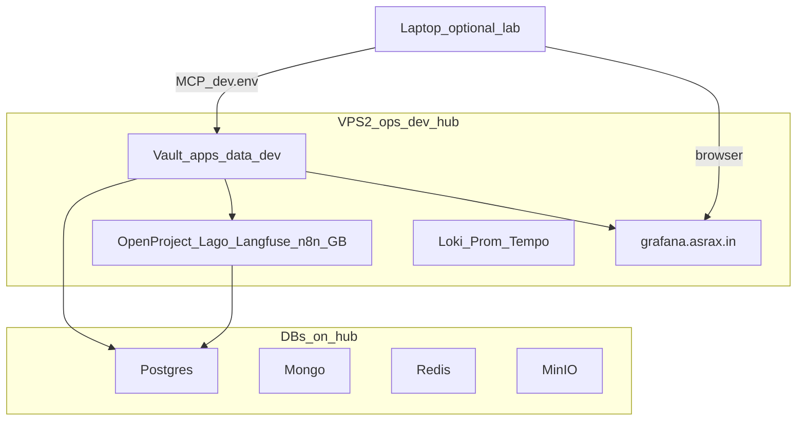

# VPS2 — ops / dev platform + credentials hub

**Role:** VPS2 is the **ops + shared platform hub** — not obs-only.  
It owns shared observability (bare `*.asrax.in`), **dev credential SoT** in Vault (`apps/data/dev/`), and G24 third-party / platform consoles that should outlive a laptop wipe.

**Related:** [OBS_VPS2_SIZING.md](OBS_VPS2_SIZING.md) · [GRAFANA_FLEET_DEV.md](GRAFANA_FLEET_DEV.md) (interim laptop hub) · [TODO.md](TODO.md) Phase 11 / 11b.

---

## Host layout

| Host | Role | Runs | Vault prefix |
|------|------|------|--------------|
| VPS1 | prod | `am-prod-*` product + stores | `apps/data/prod/` |
| **VPS2** | **ops + shared platform** | `am-obs` + platform third-parties + **Vault (`dev` SoT)** + stores needed by those apps | obs + **`apps/data/dev/`** |
| VPS3 | dr | `am-dr-*` | `apps/data/dr/` |
| Laptop | optional lab | slim Kind / travel break-glass; **not** credential SoT | read VPS2 Vault over domain / WG |

**Product apps** (`am-apps-dev` / agents) may stay on laptop until a full `am-dev-*` VPS exists. Credentials for those services still live under `apps/data/dev/` on **VPS2 Vault**.

---

## What runs on VPS2

| Layer | Components |
|-------|------------|
| Obs | Grafana, Loki, Prometheus, Tempo, Alloy local, log-janitor, Traefik/edge |
| Platform third-party | OpenProject, Lago, Langfuse, n8n, GrowthBook, LiteLLM, Temporal UI (and other G24 consoles moved off laptop) |
| Identity for hub login | Prefer Keycloak on VPS1/prod for bare Grafana SSO after Phase 10; until then `auth-dev` may still be laptop — document cutover when moving |
| Stores | PG / Redis / MinIO (and Mongo/Kafka/Influx as needed) for platform modules — **DNS-only** `*-dev.asrax.in` or hub-private names (G26) |
| Vault | KV `apps` with **`apps/data/dev/*` SoT**; unseal keys host-local + R2 (never git) |

**Forbidden on VPS2:** `am-apps-prod` / `am-apps-dr`, `kagent`, Contabo leftover names.

---

## DNS

| Class | Pattern | Examples |
|-------|---------|----------|
| Obs (shared, no env) | bare | `grafana` / `loki` / `prometheus` / `tempo`.asrax.in |
| Platform consoles | `*-dev` until prod-style bare is required | `openproject-dev`, `lago-dev`, `langfuse-dev`, `n8n-dev`, `growthbook-dev`, `vault-dev` |
| Stores | DNS-only A → VPS2 private/WG IP | `postgres-dev`, `minio-dev`, … |

Tunnel: **SoT = tunnel colocated with Grafana.** Target: VPS2 cloudflared owns bare `grafana`/`loki`/`prometheus`.asrax.in ([GRAFANA_FLEET_DEV.md](GRAFANA_FLEET_DEV.md)). Laptop lab may temporarily own those FQDNs until Phase 11 cutover — then remove laptop ingress for bare obs names.

---

## Credential inventory (must live on VPS2 Vault)

**Local dump (all values):** [VPS/credentials/dev/](../../../VPS/credentials/dev/) — run `VPS/scripts/dump_dev_credentials.ps1`.  
**Master finder:** [VPS/credentials/README.md](../../../VPS/credentials/README.md).

Copy **key names** from preprod / laptop; **rewrite** hosts/JDBC/issuers/redirects (G23/G26). Never commit values.

### Infra / DBs

| Path | Purpose |
|------|---------|
| `apps/data/dev/infra/postgres` | PG users/passwords, JDBC hosts |
| `apps/data/dev/infra/mongodb` | Mongo URIs |
| `apps/data/dev/infra/redis` | Redis ACL / URLs |
| `apps/data/dev/infra/kafka` | SCRAM / bootstrap |
| `apps/data/dev/infra/influxdb` | Influx tokens |
| `apps/data/dev/infra/minio` (or databases blob) | MinIO access keys |
| `apps/data/dev/infra/observability` | Grafana admin, bare Grafana/Loki/Prom URLs |
| `apps/data/dev/infra/keycloak-test-users` | `am-admin-test` / `am-user-test` only |
| Host-local | Vault unseal / root — `/data/am-state` + R2 disaster dump |

### OIDC clients (G24)

`apps/data/dev/oidc/<client>` (or seeded equivalent) for at least:

`grafana`, `openproject`, `lago`, `langfuse`, `n8n`, `growthbook`, `litellm`, `langfuse`, `temporal-web`, `argocd`, `minio`, `vault-ui`, `pgadmin`, `mongo-express`, `kafka-ui`, `redis-ui`, `influx-ui`, `traefik`, `novu`, `am-modern-ui`, `am-gateway`

Redirects = this hub’s domains (`https://grafana.asrax.in/*`, `https://openproject-dev.asrax.in/*`, …).

### Platform / third-party app secrets

Paths already used on laptop Kind — migrate SoT to VPS2:

| Area | Typical path / notes |
|------|----------------------|
| Grafana | `infra/observability` |
| Lago / billing | dedicated DB `lago` + OIDC `lago` |
| OpenProject | PG user `openproject` on `platform` |
| Langfuse | PG + Redis + MinIO + ClickHouse in-module |
| GrowthBook | exposer + Mongo/PG per module |
| n8n | encryption key + DB |
| LiteLLM / Langfuse / Temporal | module Vault paths under `infra/` or service catalog |
| Product services | `apps/data/dev/services/<svc>` from [apps-vault-seed catalog](../../terraform/modules/core/apps-vault-seed/catalog/services.yaml) |

### MCP / laptop

| File | Must point at |
|------|----------------|
| `~/.asrax/credentials.d/dev.env` | VPS2 Vault URL (`vault-dev.asrax.in` on hub), bare Grafana, `*-dev` consoles on VPS2 |
| `credentials.d/grafana-dev.env` | `GRAFANA_URL=https://grafana.asrax.in` (SA token) |
| `prod.env` / `dr.env` | VPS1 / VPS3 only — refuse if kube is `am-dev-*` |

---

## Sizing note

Obs-only budget ([OBS_VPS2_SIZING.md](OBS_VPS2_SIZING.md)) assumes **~8 GB**. Colocating OpenProject + Lago + Langfuse + GrowthBook + n8n + Vault + stores with Tempo → prefer **≥16 GB RAM** (or split platform stores to a second node). Do not starve Loki/Prom PVCs for app memory.

---

## Cutover checklist (Execute later)

1. Resize/prepare VPS2 (Phase 5.2).
2. Phase 11: move Grafana/Loki/Prom/Tempo + bare CF hosts to VPS2.
3. Phase 11b: install platform third-parties + stores; seed Vault `apps/data/dev`.
4. Retarget laptop MCP `dev.env` → VPS2; stop treating laptop Vault as SoT.
5. Optional: tear down laptop platform NS; keep `am-apps-dev` until product VPS exists.

---

## Related

- Phase 5 security: [PHASE5_VPS_SECURITY.md](PHASE5_VPS_SECURITY.md)
- Fleet Grafana interim: [GRAFANA_FLEET_DEV.md](GRAFANA_FLEET_DEV.md)
